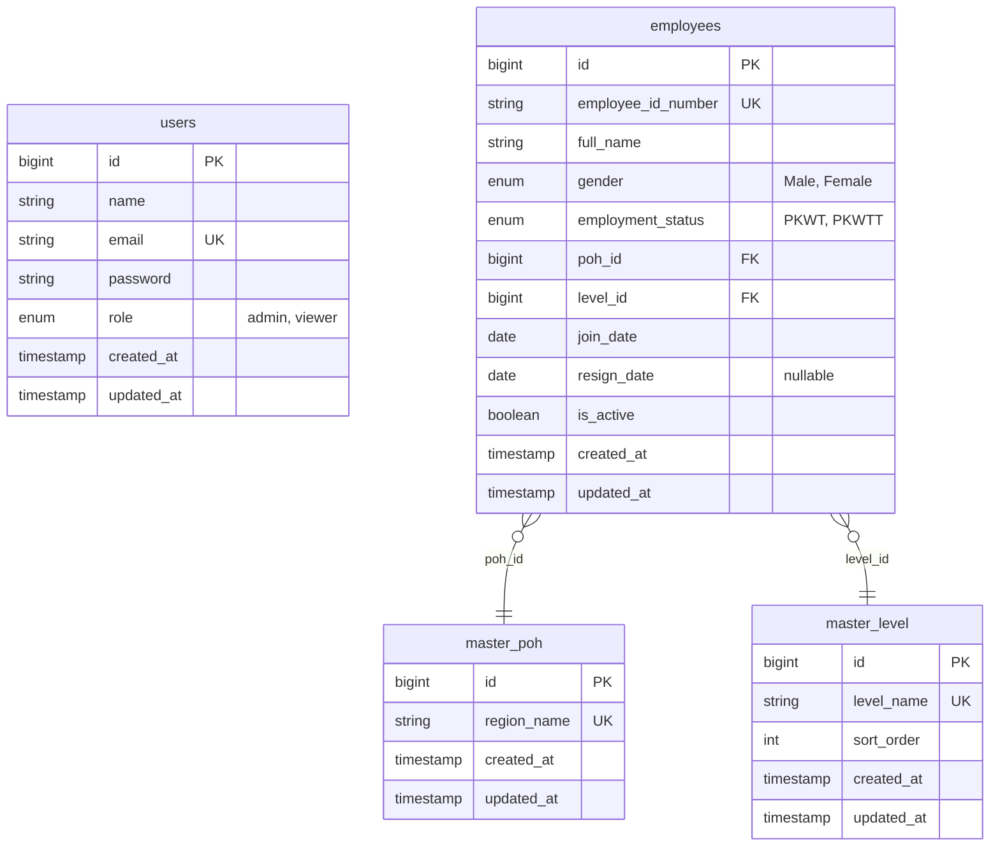

# HR Dashboard — Fullstack Implementation Plan

## Overview

Membangun sistem **HR Dashboard** komprehensif dari awal dengan fitur: Dashboard Analytics interaktif, Employee CRUD, Smart Excel Import/Export, PDF Reporting, Dark/Light Mode, dan Role-Based Access Control (RBAC).

---

## Tech Stack

| Layer | Technology | Alasan |
|-------|-----------|--------|
| **Backend** | Laravel 11 | Familiar dari project sebelumnya, ecosystem matang |
| **Frontend** | React 19 + Inertia.js | SPA feel tanpa API terpisah, session-based auth |
| **Starter Kit** | Laravel Breeze (React + TypeScript + Dark Mode) | Auth, routing, layout sudah built-in |
| **Styling** | Tailwind CSS v4 | Dark mode dengan `dark:` class, rapid prototyping |
| **UI Components** | shadcn/ui | Premium, accessible components |
| **Charts** | Recharts | SVG-based, theme-aware, React-native |
| **Database** | SQLite (dev) / PostgreSQL (prod) | Laravel default, mudah setup |
| **Excel** | Maatwebsite Laravel Excel (PhpSpreadsheet) | Native Laravel validation, template generation |
| **PDF Export** | jsPDF + html-to-image | Client-side chart capture, no server overhead |

---

## Database Schema

### ERD Diagram

### Seed Data

**`master_poh`:** Jawa, Sumatera, Kalimantan, Sulawesi, Papua, Bali & Nusa Tenggara, Maluku

**`master_level`:** BOD, Manager, Supervisor, Officer, Administrator, Non Staff

---

## Proposed Changes

### Fase 1: Foundation & Authentication
Setup project, database, auth, dan layout dasar.

### Fase 2: Dashboard Analytics
Halaman utama dengan visualisasi data komprehensif.

### Fase 3: Employee CRUD & Data Management
Halaman tabel dengan full CRUD operations.

### Fase 4: Import/Export & PDF Reporting
Smart import, template download, Excel/PDF export.

---

## Architecture details & Routing are handled inside each phases...
